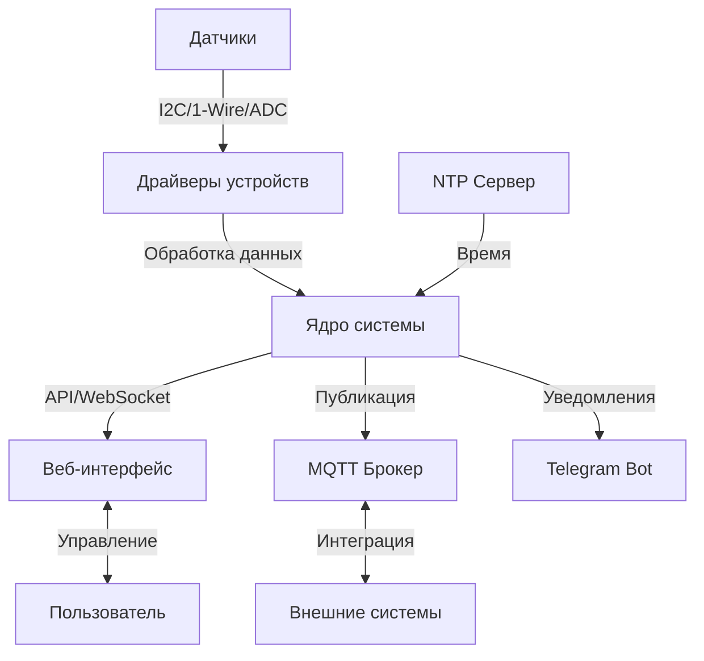

# Архитектура системы GrowBox

## Обзор

GrowBox - это система автоматизации для гидропонных установок на базе микроконтроллера ESP32. Система построена по модульному принципу с использованием FreeRTOS и включает следующие основные компоненты:

## Основные компоненты

### 1. Ядро системы (Core)
- **setup.h/cpp** - инициализация системы и настройка периферии
- **main.cpp** - точка входа в программу, инициализация FreeRTOS задач
- **preferences.h** - хранение настроек в NVS (Non-volatile storage)
- **debug_info.h** - отладочная информация и логирование

### 2. Драйверы датчиков (dev/)
- **aht10/** - датчик температуры и влажности AHT10
- **am2320/** - датчик температуры и влажности AM2320
- **bmp280/** - датчик атмосферного давления BMP280
- **ccs811/** - датчик качества воздуха CCS811
- **ds18b20/** - цифровой температурный датчик DS18B20
- **ec/** - датчик электропроводности (EC) раствора
- **hx710b/** - АЦП для датчиков веса HX710B
- **mcp23017/** - расширитель портов MCP23017
- **mcp3421/** - 18-битный АЦП MCP3421
- **ntc/** - термисторы для измерения температуры
- **ads1115/** - 16-битный АЦП ADS1115

### 3. Веб-интерфейс (web/)
- **static_common.h** - общие функции веб-сервера
- **webserver/** - обработчики HTTP-запросов
- **websocket/** - WebSocket для обновления данных в реальном времени
- **static/** - статические файлы веб-интерфейса

### 4. Сетевые сервисы
- **WiFi** - управление беспроводным подключением
- **MQTT** (mqtt/) - интеграция с MQTT брокером
  - mqtt_common.h - общие функции MQTT
  - mqtt_ha.h - интеграция с Home Assistant
  - mqtt_usual.h - стандартные MQTT-топики
- **OTA** - обновление прошивки по воздуху
- **NTP** - синхронизация времени

### 5. Внешние сервисы
- **Telegram Bot** (tgbot.h) - уведомления в Telegram
- **Syslog** - централизованное логирование

## Взаимодействие компонентов

## Поток данных и задачи

1. Датчики периодически снимают показания
2. Данные обрабатываются и фильтруются
3. Показания сохраняются в кольцевой буфер
4. Веб-интерфейс отображает текущие значения
5. MQTT-клиент публикует данные на брокер
6. Внешние системы получают обновления через MQTT

## Безопасность

- Аутентификация по токену
- Шифрование соединения (HTTPS/WSS)
- Защита от переполнения буфера
- Валидация входящих данных

## Масштабируемость

Система спроектирована с учетом возможности масштабирования:
- Поддержка до 32 датчиков
- До 16 исполнительных устройств
- Несколько независимых каналов управления
- Модульная архитектура для легкого расширения

## Ограничения

- Максимальная частота опроса датчиков: 1 Гц
- Максимальное количество клиентов: 5
- Максимальный размер пакета MQTT: 1024 байта
- Максимальная длина сообщения WebSocket: 2048 байт
