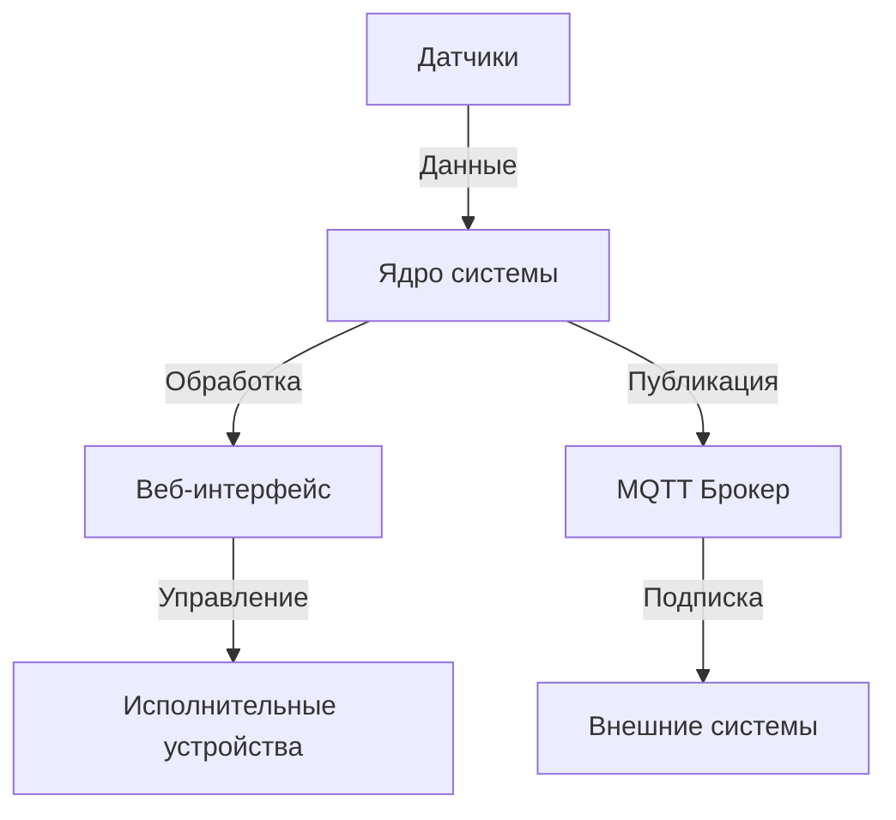

# Архитектура системы GrowBox

## Обзор

GrowBox - это система автоматизации для гидропонных установок на базе микроконтроллера ESP32. Система построена по модульному принципу и включает в себя следующие основные компоненты:

## Основные компоненты

### 1. Ядро системы
- **main.cpp** - точка входа в программу
- **config.h** - основные настройки и конфигурация
- **params.h** - параметры и их обработка

### 2. Драйверы датчиков
- **sensors/** - директория с драйверами датчиков
  - temperature/
  - humidity/
  - ph/
  - ec/
  - water_level/

### 3. Веб-интерфейс
- **web/** - веб-интерфейс и API
  - static/ - статические файлы
  - api/ - обработчики API
  - websocket/ - веб-сокеты для реального времени

### 4. Сетевые сервисы
- **network/** - сетевое взаимодействие
  - wifi/ - управление WiFi
  - mqtt/ - MQTT клиент
  - ota/ - обновление по воздуху

### 5. Автоматизация
- **automation/** - сценарии и автоматизация
  - scheduler/ - планировщик задач
  - rules/ - правила автоматизации

## Взаимодействие компонентов

## Поток данных

1. Датчики периодически снимают показания
2. Данные обрабатываются и фильтруются
3. Показания сохраняются в кольцевой буфер
4. Веб-интерфейс отображает текущие значения
5. MQTT-клиент публикует данные на брокер
6. Внешние системы получают обновления через MQTT

## Безопасность

- Аутентификация по токену
- Шифрование соединения (HTTPS/WSS)
- Защита от переполнения буфера
- Валидация входящих данных

## Масштабируемость

Система спроектирована с учетом возможности масштабирования:
- Поддержка до 32 датчиков
- До 16 исполнительных устройств
- Несколько независимых каналов управления
- Модульная архитектура для легкого расширения

## Ограничения

- Максимальная частота опроса датчиков: 1 Гц
- Максимальное количество клиентов: 5
- Максимальный размер пакета MQTT: 1024 байта
- Максимальная длина сообщения WebSocket: 2048 байт
