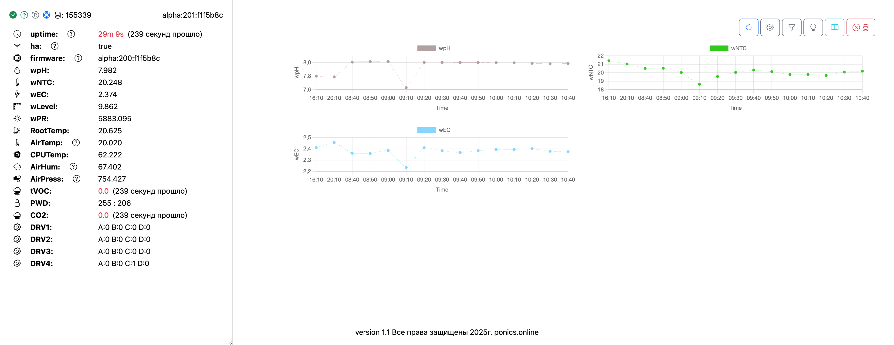

# GrowBox

Проект GrowBox предназначен для мониторинга и управления параметрами роста растений с помощью подключаемых датчиков. Подходит для энтузиастов и разработчиков, которые хотят настроить систему под свои нужды.

## Описание

GrowBox собирает данные с датчиков, поддерживает веб-интерфейс для калибровки и управления, а также интеграцию с системами автоматизации через MQTT.

Версия с интеграцией с [ponics.online](https://ponics.online) отключена, но доступна на сайте.  

## Функционал
- **Сбор данных с датчиков**:
  Подключение и получение данных от разнообразных сенсоров.
- **Обновление по воздуху (OTA)**:
  Прошивка устройства через URL.
- **Прошивка через Arduino IDE**:
  Удобный способ загрузки стандартной прошивки.
- **Хранение настроек**:
  Все настройки организованы в структуре.
- **Оптимизация производительности**:
  - Уменьшено время выполнения задач.
  - Убран ненужный код (но есть еще над чем работать).
- **Веб-интерфейс**:
  - Реализован для управления устройством.
  - Постепенно переносится функционал калибровки, чтобы минимизировать зависимость от сервера.
- **Интеграция с Home Assistant**:
  - Поддержка MQTT с автодискавери.
- **Оптимизация работы с MQTT**:
  - Реализована отдельная обработка большого потока сообщений, чтобы избежать перегрузки.

## Поддерживаемые датчики и устройства

### Датчики расстояния и уровня
- **US-025** — Ультразвуковой датчик для измерения расстояния.
- **VL6180X** — Лазерный датчик расстояния с функцией измерения окружающего света.
- **VL53L0X** — Высокоточный лазерный датчик измерения расстояния.

### Температура и влажность воздуха
- **NTC** — Терморезистор для измерения температуры.
- **AHT10** — Датчик температуры и влажности с высокой точностью.
- **AM2320** — Датчик температуры и влажности с цифровым интерфейсом.

### Электропроводность и pH
- **EC Meter** (через ADS1115) — Измерение электропроводности растворов.
- **MCP3421** — АЦП для измерения аналоговых сигналов, например, pH.

### Давление и высота
- **BMP280** — Барометрический датчик для измерения давления и высоты.

### Температура
- **DS18B20** — Высокоточный цифровой датчик температуры.

### Воздушное качество
- **CCS811** — Датчик для мониторинга качества воздуха (CO₂ и VOC).
- **SCD30** — Датчик концентрации CO₂, температуры и влажности.

### Прецизионные датчики
- **ADS1115** — АЦП с высокой точностью для подключения аналоговых сенсоров.
- **HX710B** — Прецизионный усилитель для работы с весовыми датчиками.

### Устройства управления
- **MCP23017** — Расширитель I/O портов для управления внешними устройствами.
- **Doser** — Управление дозаторами удобрений.

### Мониторинг напряжения
- **VCC Monitor** — Мониторинг напряжения питания устройства.

### Отображение данных
- **LCD** — Дисплей для вывода информации в реальном времени.

### Управление системой
- **CPUT** — Мониторинг загрузки центрального процессора.

### Прочие устройства
- **PR (Photoresistor)** — Фоторезистор для измерения уровня освещенности.

## Обработка данных и фильтры
- **Сглаживание данных**:
  Применяется скользящее среднее для уменьшения шумов и повышения точности измерений.
- **Калибровка**:
  Возможность настройки датчиков для точных измерений.
- **Пороговые значения**:
  Определяются допустимые диапазоны параметров для оповещений при выходе за пределы нормы.

## Особенности
- Требуется сборка устройства:
  - Можно заказать плату, собрать самостоятельно или приобрести готовый комплект.
- Датчики приобретаются отдельно.
- Возможность приобрести собранное устройство для упрощения установки.

## Калибровка
Подробности по калибровке доступны [в документации](https://ponics.online/wiki/). В дальнейшем они будут включены в репозиторий, как только процесс будет полностью перенесен на устройство.

## Интерфейс
Текущий вид веб-интерфейса:

